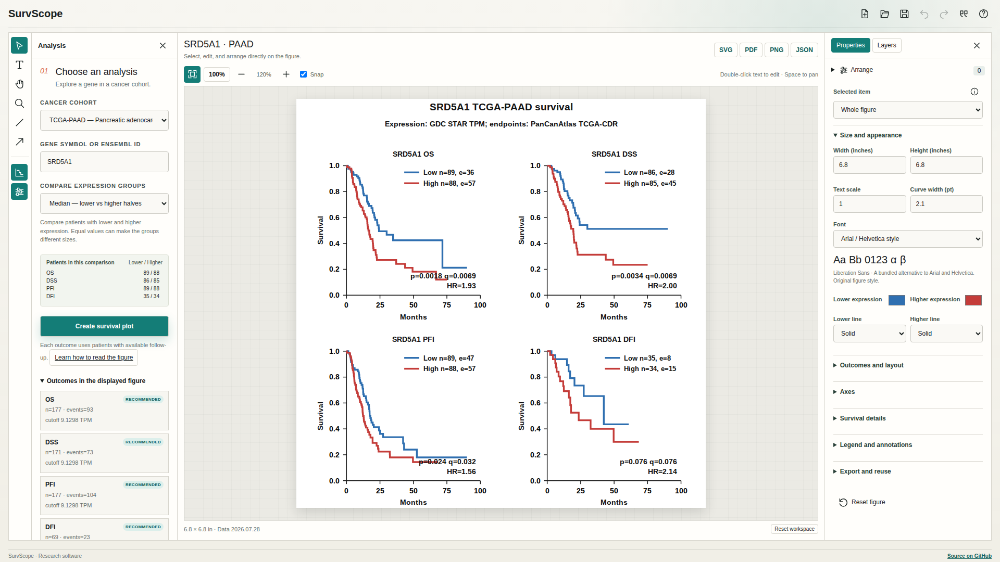

# SurvScope

[](https://github.com/oncologylab/survscope/actions/workflows/ci.yml)
[](https://oncologylab.github.io/survscope/)

**Explore how a gene's RNA expression relates to survival in a cancer cohort, then edit and download the figure.** SurvScope works in your browser, without an account or installation.

[**Open SurvScope →**](https://oncologylab.github.io/survscope/) · [Step-by-step guide](docs/user-guide.md) · [Statistical methods](docs/methods.md)



## Make your first figure

1. Choose a cancer cohort and enter a gene symbol, such as **SRD5A1** or **TP53**.
2. Choose how to compare lower and higher expression. Start with the median, or try a percentile, the lowest/highest quarters or thirds, custom percentile groups, the mean, or a TPM threshold. Check the patient counts before running.
3. Select **Create survival plot**. Each panel shows a different outcome, when available.
4. **Double-click text on the figure to edit it.** Select and drag objects; use Properties for fonts, colors, dimensions, axes, and layout, or Layers to hide and lock objects. Optional confidence bands, censor marks, and number-at-risk tables add context.
5. Download **SVG**, **PDF**, or **PNG**. **Save project** lets you reopen the results and keep editing; a style preset reuses the appearance for another analysis.

The workspace fills your screen, with collapsible Analysis and Properties panels. Familiar Selection (V), Type (T), Hand (H), and Zoom (Z) tools help you arrange the figure. Icon commands explain themselves on hover or keyboard focus. Text supports bold, italic, superscripts, and subscripts, with seven bundled [font choices](docs/user-guide.md#choose-a-font), including clearly labeled Arial/Helvetica-style alternatives.

The original blue/red, four-panel, 6.8-inch figure remains the default. Editing the figure's appearance does not change the calculated results.

## Which cancers and data are available?

The current release includes **all 33 TCGA cohorts and 18 CPTAC-3 tumor groups**, covering 59,317 uniquely mapped gene symbols. TCGA and CPTAC appear separately in the cohort menu, with patient counts; pancreatic cancer is one of many choices. Availability varies by gene and outcome.

TCGA provides overall survival (OS), disease-specific survival (DSS), progression-free interval (PFI), and disease-free interval (DFI), where the source supports them. CPTAC currently provides **RNA expression and OS**. Protein abundance and CPTAC-2 survival are not included. Some rare CPTAC groups have only one or two patients and cannot support an estimable comparison. See the [coverage table and sources](docs/cptac.md).

## Read the results carefully

A curve estimates the fraction of patients who remain event-free over time. The legend gives patients (`n`) and events (`e`) in each group. The p-value compares the curves; the hazard ratio compares higher with lower expression. These are unadjusted associations, not proof that a gene causes a difference or predicts an individual's outcome.

Comparing selected lower and upper percentile groups leaves out the middle patients and can increase uncertainty. Trying several genes or group definitions adds multiple comparisons; the displayed q-value adjusts only for the available outcomes **within one analysis**. Choose comparisons for a scientific reason and report what you explored. [Learn to read the plot](docs/user-guide.md#understand-the-figure).

JavaScript calculations are checked against Python and independently executed R `survival`. Group membership, event counts, and risk counts agree exactly in the validation suite. Numerical tolerances and the preserved PAAD reference estimates are documented in [methods and validation](docs/methods.md#validation).

## Cite the data behind your figure

Choose **Cite this analysis** beside the save/export controls. Copy the references, download **BibTeX** or **RIS** for a reference manager, or copy a methods paragraph with your gene, cohort, group sizes, exclusions, and data version. Citations follow the displayed result, even while you are choosing the next analysis.

TCGA analyses cite **TCGA-CDR** for survival outcomes, **UCSC Xena** for data distribution, and **GDC** for the data resource. CPTAC analyses cite **CPTAC-3** and **GDC** and its survival documentation. Verified original cohort papers appear alongside those sources. The analyzed patients may differ from the publication's original cohort. [Full references and citation guidance](docs/citations.md).

## Use Python or the command line

Install the tested [GitHub release](https://github.com/oncologylab/survscope/releases/tag/v0.4.1):

```bash
python -m pip install \
  https://github.com/oncologylab/survscope/releases/download/v0.4.1/survscope-0.4.1-py3-none-any.whl
survscope plot --gene SRD5A1 --cohort PAAD --format pdf svg png --outdir plots
survscope plot --gene TP53 --cohort CPTAC-3-LUAD \
  --grouping percentile_groups --lower-percent 25 --upper-percent 25 --json --outdir plots
```

```python
import survscope
from survscope import GroupingSpec

result = survscope.analyze(
    "SRD5A1", "PAAD",
    grouping=GroupingSpec("percentile_groups", lower_percent=25, upper_percent=25),
)
survscope.plot(result, formats=("pdf", "svg"), output_dir="plots")
```

The Python package shares the comparison methods and the default figure. The interactive editor and its project files are browser features. PyPI publication awaits its one-time [Trusted Publisher setup](docs/publishing.md); use the GitHub wheel meanwhile.

## Reproducibility and further reading

The website displays its data version. Data releases are immutable; saved projects record both data and software versions. Browser calculations use static assets served with the site, with no external data-service requests or telemetry. Published assets contain no patient identifiers or raw expression matrices.

- [User guide](docs/user-guide.md): comparisons, editing, downloads, and common questions
- [Methods](docs/methods.md): grouping, statistics, reference validation, and limitations
- [CPTAC coverage and research](docs/cptac.md): included cohorts, sources, and exclusions
- [Development and releases](docs/development.md): local setup, checks, and deployment
- [Data format](docs/data-format.md): compact assets and provenance

For scientific use, include the software and the references provided by **Cite this analysis** for your selected cohort. SurvScope is research software, not a diagnostic or clinical decision-making tool.

Source code uses the [MIT License](LICENSE). Bundled fonts and numerical code retain their [third-party notices](web/public/third-party-notices.txt); data retain their original terms and citations.
