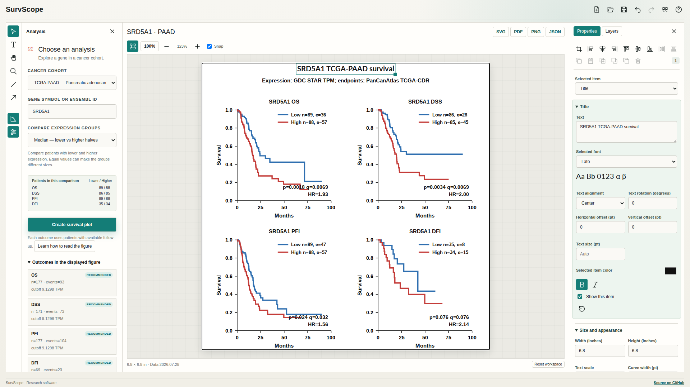
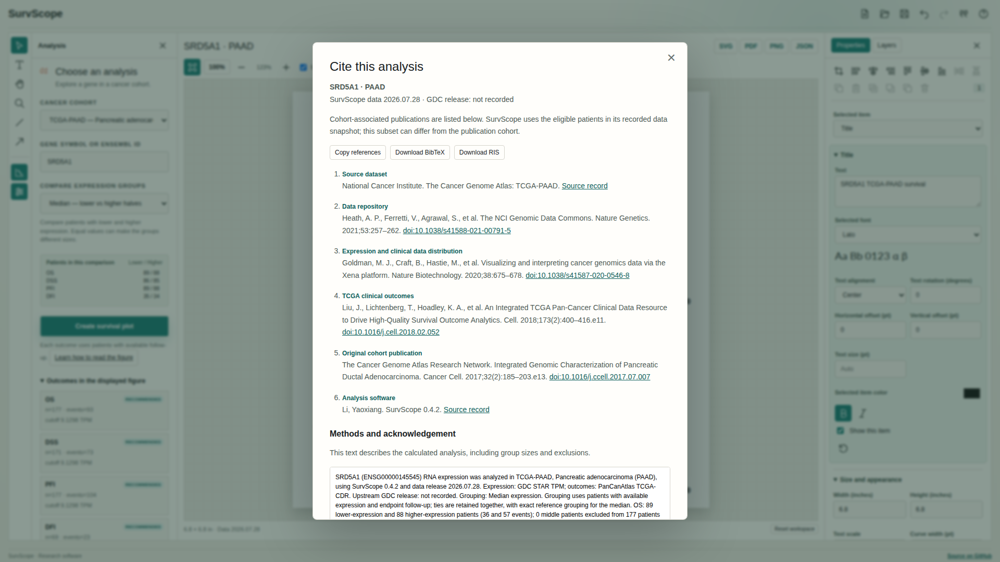

# Your guide to SurvScope

[Open the website](https://oncologylab.github.io/survscope/) to explore a gene and make an editable survival figure. You do not need to install software or upload a dataset.

## Choose patients and a gene

The **Cancer cohort** menu groups cancers by study: TCGA and CPTAC. The same cancer in two studies represents two separate patient groups. For example, `TCGA-PAAD` and `CPTAC-3-PAAD` both concern pancreatic cancer but are analyzed separately.

Enter a gene symbol, such as **TP53**, or its Ensembl identifier. Suggestions show genes available in the selected cohort. A cohort's menu count is its available patient total; the plot may use fewer people because follow-up or expression can be missing.

## Choose an expression comparison

Every comparison makes two groups, lower and higher expression. The selector offers:

| Choice | What it compares | Patients left out |
| --- | --- | --- |
| Median | At or below the middle expression value versus above it | None with usable expression and follow-up |
| Mean | At or below the average TPM versus above it | None with usable expression and follow-up |
| Percentile | A chosen dividing point; for example, the 75th percentile | None with usable expression and follow-up |
| Lowest/highest quarter | The bottom 25% versus the top 25% | Middle expression values |
| Lowest/highest third | The bottom third versus the top third | Middle expression values |
| Custom percentile groups | For example, the lowest 20% versus the highest 30% | The gap between those groups |
| Custom TPM threshold | At or below a number you enter versus above it | None with usable expression and follow-up |

TPM measures a gene's RNA abundance relative to the other RNA in a sample. The mean uses TPM values, not their logarithms. Equal values stay together, so a “quarter” or “half” may not contain exactly that proportion of patients. If many patients have the same value, a group can even be empty. SurvScope shows the actual group sizes before you create the plot.

Each outcome uses patients with valid follow-up for that outcome. Its dividing values and group sizes may therefore differ. A 50th-percentile split, or two complementary 50% groups, uses the original median comparison exactly. Complementary custom fractions such as 30%/70% form one percentile split without a middle exclusion.

The median retains the original source grouping. Other choices use compact expression values rounded to 0.001 in `log2(TPM+1)` units. Very close expression values can therefore share a value; see [methods](methods.md) for the reproducibility details.

Select **Create survival plot** after changing a gene, cohort, or comparison. A notice tells you when your current selections differ from the displayed result. Comparing selected lower and upper percentiles uses fewer patients and can change the observed pattern. SurvScope does not automatically search for a cutoff that makes a p-value smaller.

## Understand the figure

A Kaplan–Meier curve starts at 1 (100%). It steps down when an event occurs. A higher curve indicates a larger estimated fraction of patients still free of that event. The meaning of “event” depends on the outcome:

| Panel | Outcome | Event of interest |
| --- | --- | --- |
| OS | Overall survival | Death from any cause |
| DSS | Disease-specific survival | Death attributed to the cancer |
| PFI | Progression-free interval | A progression-related event under the TCGA-CDR definition |
| DFI | Disease-free interval | A disease-free interval ending in a new tumor event under TCGA-CDR eligibility rules |

CPTAC currently supports OS only. Its remaining panels say **Endpoint unavailable**. TCGA quality labels reproduce the source's recommendations; a **caution** or **not recommended** outcome needs particular care. CPTAC has a separate caution about follow-up completeness. Very small groups may have no usable group comparison.

- **n** is the number of patients with usable follow-up in a group; **e** counts patients with an observed event. For OS, that event is death. The other patients are censored: follow-up ended without the event being observed. Therefore **e ≤ n**; equality is possible when every included patient has an event.
- **p** is the two-sided log-rank p-value. It concerns the difference between these two curves, not whether the finding will reproduce elsewhere.
- **q** adjusts the available endpoint p-values for this one gene, cohort, and comparison. With only one tested outcome (current CPTAC analyses), **q = p**, so the figure shows p alone. With several outcomes, some BH-adjusted values can also equal p, and rounded values may look equal. Hiding panels does not change the adjustment. It does not correct for trying many genes, cohorts, or cutoffs; analysis JSON keeps the full-precision values.
- **HR** is the unadjusted hazard ratio for higher versus lower expression. Above 1 indicates a higher modeled event hazard in the higher-expression group. Interpretation assumes proportional hazards; the application does not test this assumption or adjust for stage, treatment, age, or other factors.
- **NA** means the statistic cannot be estimated. Empty groups, no events, lack of overlapping risk sets, or complete separation can cause this. The available curves may still be shown.

In **Properties → Survival details**, you can add:

- **Confidence bands:** pointwise uncertainty around each curve, at 90%, 95%, or 99%. Wider bands indicate less precision. The bands do not provide a separate test of the difference between curves.
- **Censor marks:** a plus sign where a patient's observed follow-up ends without the recorded event. Several patients can share a mark.
- **Number-at-risk tables:** how many people are still observed and event-free immediately before each displayed time. A patient censored exactly at that time is still counted just before it.

These three additions are off initially, preserving the original appearance. Research associations should be interpreted alongside study design and independent evidence.

## Edit the figure

Your figure is ready to edit as soon as it appears. Double-click a title, axis label, complete legend entry, or note to type directly on the figure. Select individual characters to apply bold, italic, superscript, or subscript using the floating text toolbar. Enter adds a line; Escape or clicking outside finishes the edit. Saving or exporting also finishes an active text edit.

The editing commands use familiar icons: a pointer for Selection, a T for Type, a hand for panning, a disk for saving, and curved arrows for Undo/Redo. Hover over an icon, or focus it with Tab, to see its name and keyboard shortcut. Alignment, distribution, copying, annotation order, and text formatting use the same icon controls. Unavailable actions are dimmed. The compact toolbar at the top of Properties has alignment and annotation commands; its number badge shows how many objects are selected.

The workspace fills wide displays. **Analysis** sits on the left and **Properties / Layers** on the right; use the rail buttons to open or close them. Drag the panel boundaries to adjust their widths. On smaller screens, the panels open as drawers so the figure keeps its space. **Reset workspace** restores the panel sizes and Fit view without changing your figure.

Click a title, axis label, legend, statistics block, curve, or panel. You can also choose **Selected item**, which helps with overlapping or hidden items. Drag labels, legends, statistics, panels, and annotations to move them. A selected panel has a corner handle for resizing. An arrow or line has a handle for moving its endpoint. Curve selection changes line appearance while keeping the data attached to its axes.

Shift-click to select several objects, or drag a selection rectangle on the artboard. **Arrange** shows the selection count and icons for aligning objects and distributing three or more objects evenly. Toggle the artboard icon to align to the page instead of the selection; the reference is displayed beside it. **Snap** shows alignment guides near object edges and centers. In **Layers**, the eye and padlock icons hide or lock objects. Copy, paste, duplicate, and reorder annotations with the Arrange controls. Locked panels also protect their contents from movement.

| Shortcut | Action outside a text field |
| --- | --- |
| V / T / H / Z | Selection / Type / Hand / Zoom |
| Space (hold) | Temporarily pan |
| Arrow / Shift+Arrow | Move selection by 1 / 10 points |
| Ctrl/Cmd+Z / Ctrl/Cmd+Shift+Z | Undo / redo |
| Ctrl/Cmd+C / Ctrl/Cmd+V | Copy / paste selected annotations within the workspace |
| Ctrl/Cmd+D | Duplicate selected annotations |
| Delete | Remove selected annotations |

With Type, click an empty part of the artboard to create a note. Drag with Line or Arrow to draw a new annotation. A text object's corner handle scales its type; panel resizing keeps type and stroke sizes fixed. While typing, Ctrl/Cmd+B and Ctrl/Cmd+I format the selected text. Browser shortcuts such as Save and Bookmark remain available.

The editor offers:

- **Size and appearance:** width and height in inches, font family, text scale, colors, line width, and solid/dashed/dotted curves. Titles and labels also have individual text and style controls; Enter in a numeric field applies the value.
- **Outcomes and layout:** show selected panels, arrange a grid or row/column, and change their order. This changes presentation only; q-values still reflect all valid outcomes from the analysis.
- **Axes:** show months, years, or days; set a displayed time range and tick spacing; zoom into a survival range. Axis limits do not truncate follow-up or refit the model. Extremely dense requested ticks are thinned to keep the figure responsive.
- **Legend and annotations:** double-click any complete legend entry, including its `n=…` and `e=…`, to edit and format all its text. Each outcome has separate entries. Legend edits change the figure only; the analysis JSON, curves, and citations retain the original calculated counts. **Reset selected item** restores the automatic entry. The lower/higher group-name fields apply names across all outcomes and restore their automatic counts. Add notes, lines, or arrows, and use multiple lines when needed. Calculated p, q, and HR values remain linked to the analysis.

Use **Fit**, **100%**, the zoom buttons, and the **Hand tool** to inspect details without changing export dimensions. With focus on the figure, arrow keys move the selected item by one point; hold Shift for ten points. **Undo/Redo** also respond to Ctrl/Cmd+Z and Ctrl/Cmd+Shift+Z. **Reset figure** returns to the original appearance and can itself be undone.

A new gene, cohort, or comparison retains styling and layout, refreshes automatic labels, and clears custom label text and annotations tied to the previous result. Save a project first if you want to keep those edits. When making a smaller figure, check that labels and panels have enough room; the editor allows deliberate overlaps.

### Choose a font

Use **Size and appearance → Font** for the whole figure, or **Selected font** for one text object. The menu shows a live sample and the actual bundled font name. Seven families are available, each with regular, bold, italic, and bold italic faces:

| Menu choice | Font used in the figure and exports |
| --- | --- |
| Arial / Helvetica style | Liberation Sans — the original figure font |
| Times New Roman style | Liberation Serif |
| Courier New style | Liberation Mono |
| Calibri style | Carlito |
| Lato | Lato |
| Source Sans 3 | Source Sans 3 |
| Source Serif 4 | Source Serif 4 |

The familiar-name choices are clearly labeled alternatives, not the proprietary Arial, Helvetica, Times New Roman, Courier New, or Calibri font files. SVG and PDF embed the fonts; PNG captures the same lettering as pixels. The figure therefore does not depend on which fonts are installed on a reader's computer. Projects preserve your global and individual font choices. [Font sources and licenses](fonts.md).

## Download, save, and reopen

| Button or file | Use it for |
| --- | --- |
| SVG | A scalable figure with embedded fonts, suitable for further vector editing |
| PDF | A vector figure with embedded fonts and the chosen physical page size |
| PNG | A raster image; choose 150, 300, or 600 DPI in **Export and reuse** |
| JSON | Analysis results and provenance; it does not save the editor layout |
| Save project | Results, aggregate curves/risk counts, labels, annotations, appearance, and data/software versions |
| Save style preset | Reusable appearance without old custom text or annotations |

For example, 6.8 inches at 300 DPI produces a 2040 × 2040 PNG. Very large PNGs exceeding 40 million pixels require a smaller size or lower DPI. SVG and PDF retain vector lines and text. Zoom and selection handles are excluded from exports.

**Open project** accepts a saved project or preset from your computer. Project results reopen as a snapshot and remain editable without retrieving the original data. A project from an older data release keeps that release's results: choose **New analysis** explicitly to calculate using the website's current data. A project is not an upload to a server; files are read locally in the browser.

A URL records gene, cohort, and comparison choices. Share the project file when you also want to share the exact edited figure. Projects include aggregate curve data, not patient identifiers or a raw expression matrix.

## Cite an analysis

Choose **Cite this analysis** to see the references for the result currently displayed. **Copy references**, **Download BibTeX**, and **Download RIS** help you transfer them to a manuscript or reference manager. The methods box includes the gene, cohort, grouping rule, outcome counts, exclusions, software/data versions, and the relevant program acknowledgement.

TCGA and CPTAC have separate source citations. Original cohort papers are included when their association has been verified; the actual patients used by SurvScope may be a subset or come from an updated source snapshot. If no paper has been verified for a rare classification, the panel says so and provides its source dataset and resource references. An upstream version that was not recorded is displayed as **not recorded**.

Save the project to keep this citation snapshot with the figure. [Full references and source information](citations.md).

## Common questions

**Why is n larger than e?** A patient can contribute follow-up without having an observed event. For example, n=100 and e=30 means 30 events and 70 censored observations. n and e can be equal; e cannot exceed n.

**Why are p and q equal in CPTAC?** Current CPTAC data provide overall survival only. Benjamini–Hochberg adjustment of one test leaves its p-value unchanged. The figure omits the duplicate q label, while JSON retains both values. The information icon next to the q control explains how many outcomes were tested.

**Why do the group counts differ from the cohort count?** Missing expression, missing outcomes, or nonpositive follow-up time exclude a patient from that outcome. Custom percentile comparisons also leave out the middle expression values.

**Why did a percentile not split the group evenly?** Equal expression values are kept together. Percentiles define expression thresholds, not an arbitrary ordering of people with the same value.

**Can I see protein expression from CPTAC?** This release analyzes RNA TPM. Protein abundance uses different assays, units, and missing-data rules and is not included.

**Will another cutoff produce a stronger difference?** It can change the pattern in either direction. Exploring many choices increases the chance of an accidental finding. Report the comparisons tried and validate interesting findings independently.

**What should I keep for reproducibility?** Save the project, analysis JSON, and the software/data versions. Describe your gene, cohort, endpoint, grouping rule, omitted patients, and any exploration of multiple comparisons. [Statistical methods](methods.md) explains the calculations.
